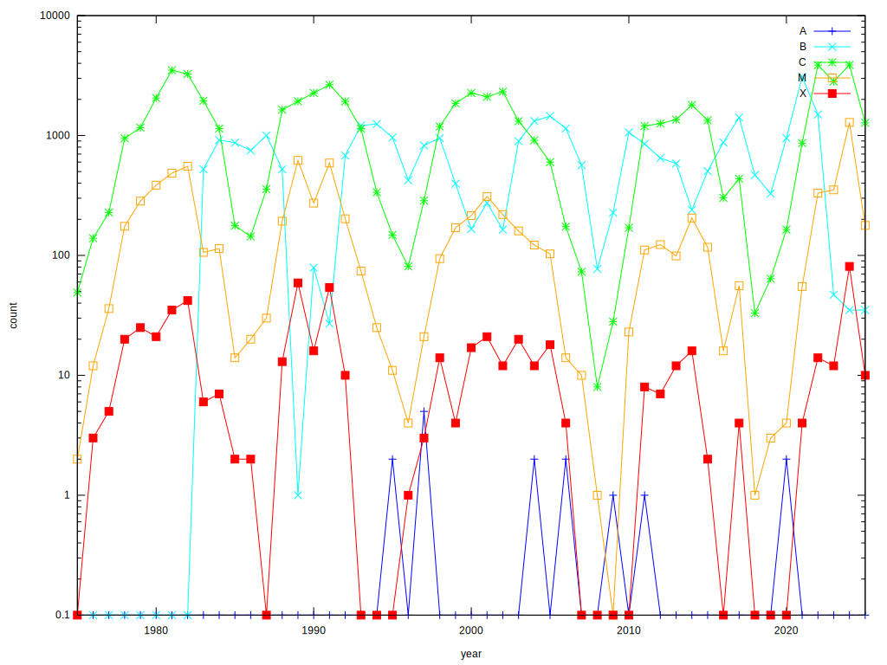
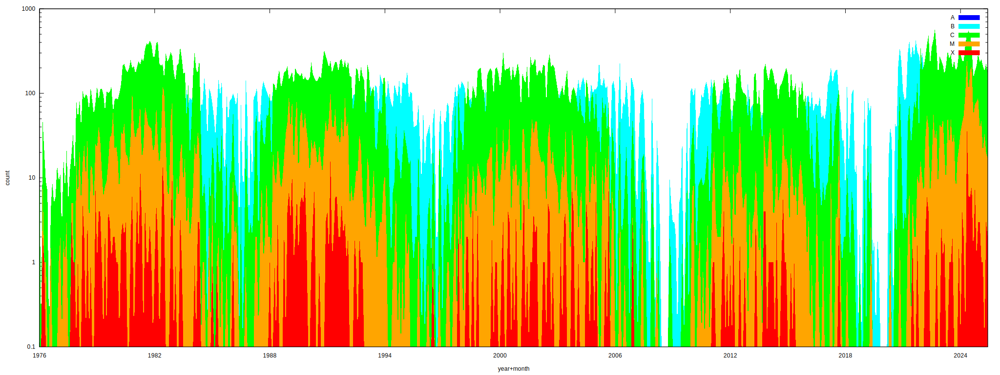
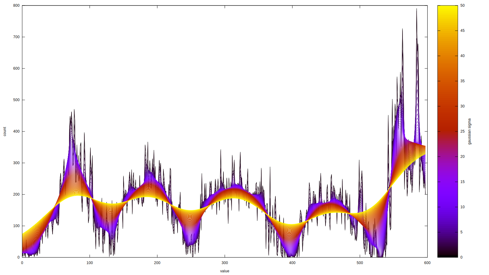

 
 

# Flares Per Class Per Year

# Flares Per Class Per Month 

# Total Flares Per Month

# ...smoothed

Usage:

1) `download-txts.lua` ... for the old txt data

2) `download-ncs.lua` ... for the up to the most recent .ncs data

3) to convert the old txt into nc's:

3.1) `mkdir nc_txt`

3.2) `cp txt/* nc_txt/`

3.3) `rm nc_txt/goes-xrs-report_2015.txt`	 because it has duplicates of `goes-xrs-report_2015_modifiedreplacedmissingrows.txt`

3.4) `rm nc_txt/goes-xrs-report_2017-input-ytd.txt` because it's nonsense

3.5) to convert the new nc's into txts:

3.6) `./nc_to_txt.lua`

4) `./count-flares.lua`		
	This will write 'flares-per-type-per-year.txt' as per-year flares of each type.
	This will also write 'flares-per-type-per-month.txt' as per-month flares of each type.
	This will also write 'totalflares-per-month.txt' as per-month total flares.

5) `./plot.gnuplot`

6) `./smoothplot.sh`

netcdf files from https://data.ngdc.noaa.gov/platforms/solar-space-observing-satellites/goes/goes16/l2/data/xrsf-l2-flsum/2021/10/

txt location:
https://www.ngdc.noaa.gov/stp/space-weather/solar-data/solar-features/solar-flares/x-rays/goes/xrs/

netcdf location:
https://data.ngdc.noaa.gov/platforms/solar-space-observing-satellites/goes/goes16/l2/data/xrsf-l2-flsum/ 4-digit-year (2017-2022) `/` 2-digit-month (1-12) `/`
filename:
`dn_xrsf-l2-flsum_g16_d` 4-digit-year 2-digit-month 2-digit-day `_v2-1-0.nc`
